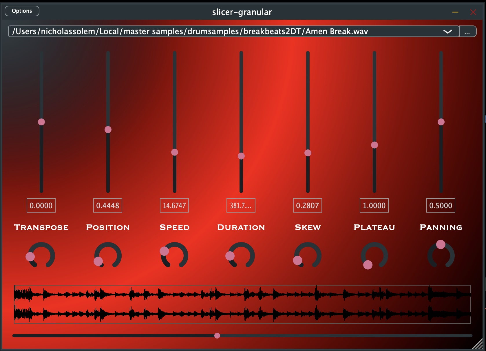

slicer-granular is a granular synthesizer, developed primarily as the basis of a more advanced [granular synth that incorporates timbre space navigation (TSN) capabilities](https://github.com/nvssynthesis/tsn-granular/). 

the design here is optimized for maintainability and extendability. for instance, it will be simple to add many new parameters without altering lots of areas of the code.

features:
<ul>
<li>granulation of lossless audio files</li>
<li>simple audio file importing, with stored history of recent files</li>
<li>crude visual reaction to transient audio events</li>
</ul>
parameters:
<ul>
<li>transpose + randomness amount</li>
<li>position + randomness amount</li>
<li>speed + randomness amount</li>
<li>duration + randomness amount</li>
<li>skew + randomness amount</li>
<li>pan + randomness amount</li>
</ul>

dependencies:

<a href="https://github.com/Reputeless/Xoshiro-cpp">Xoshiro-cpp</a>, a good random number generator for audio uses

<a href="https://github.com/serge-sans-paille/frozen">frozen map</a>, a map data structure which is  statically initialized. actually, you don't need this if you #define FROZEN_MAP 0; instead it will then use the StaticMap data structure defined in this repo's DataStructures.h. However, as the project grows I may use more data structures from frozen.

<a href="https://github.com/fmtlib/fmt">fmt</a>, formatting library. not yet used in an important way but it likely will be; for now it won't simply compile without it.

from my libraries:
<a href="https://github.com/nvssynthesis/nvs_libraries">nvs_libraries</a>, in particular nvs_gen, nvs_memoryless
